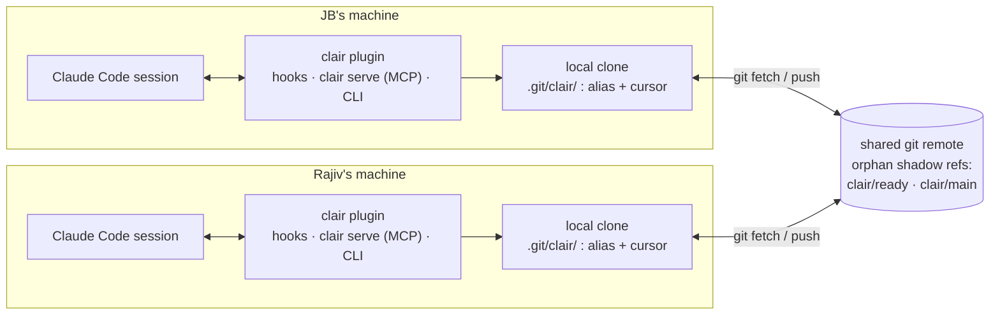
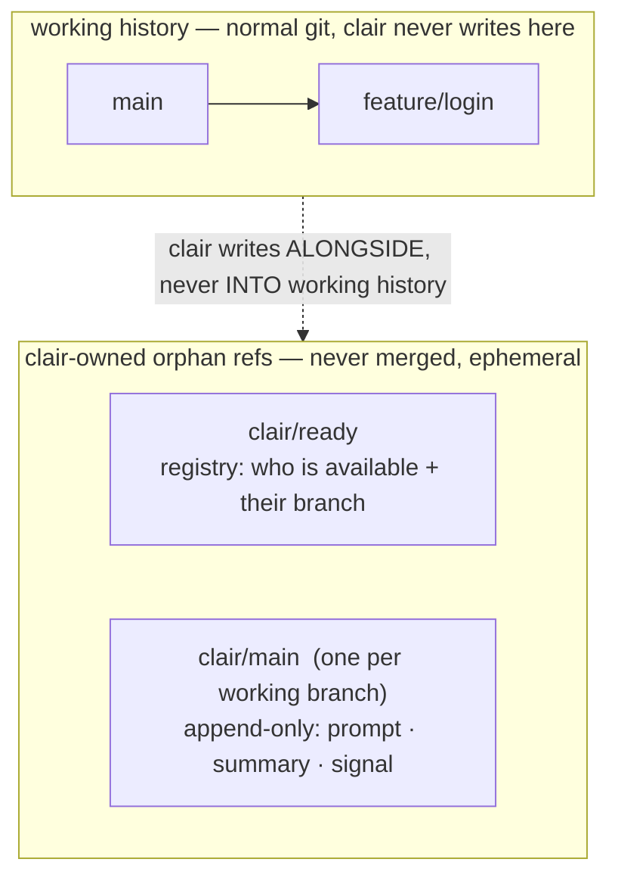
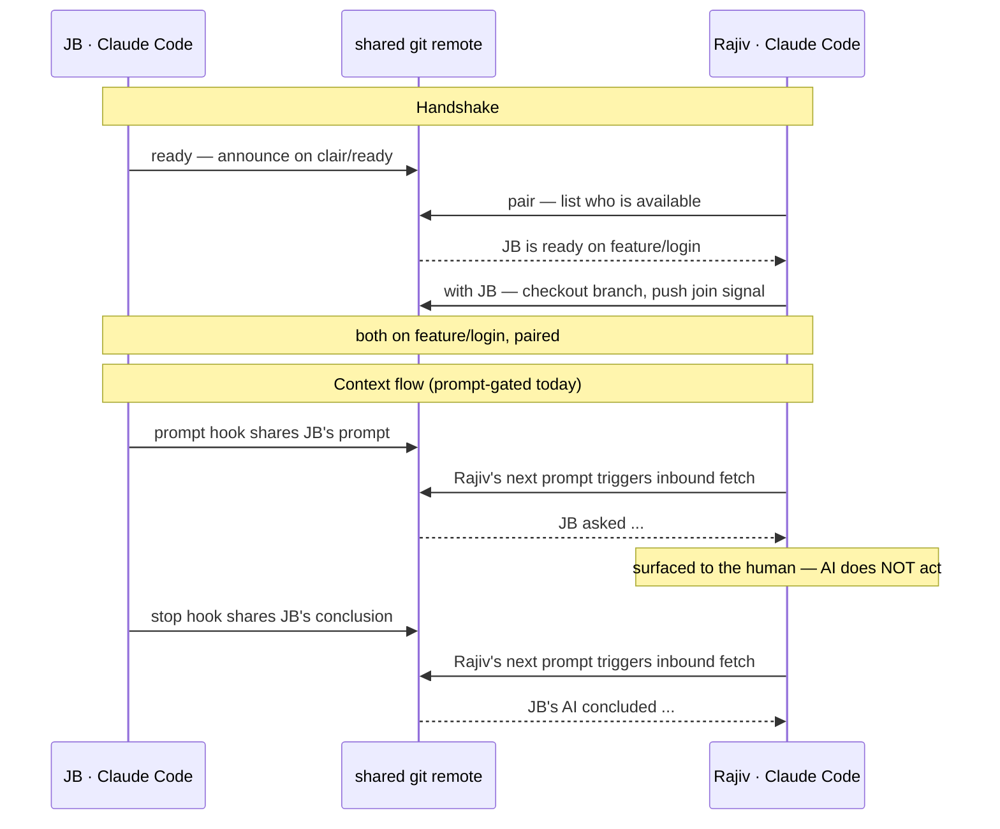
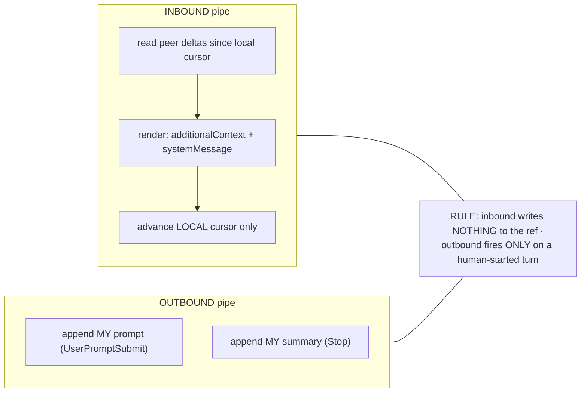
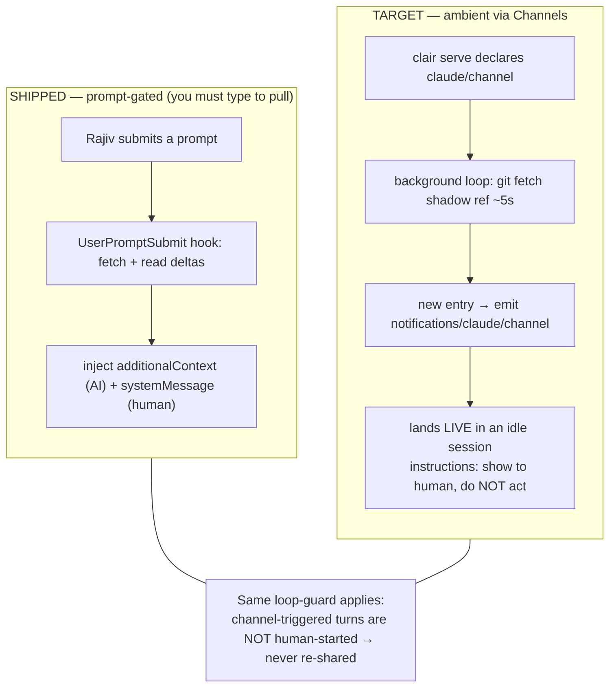
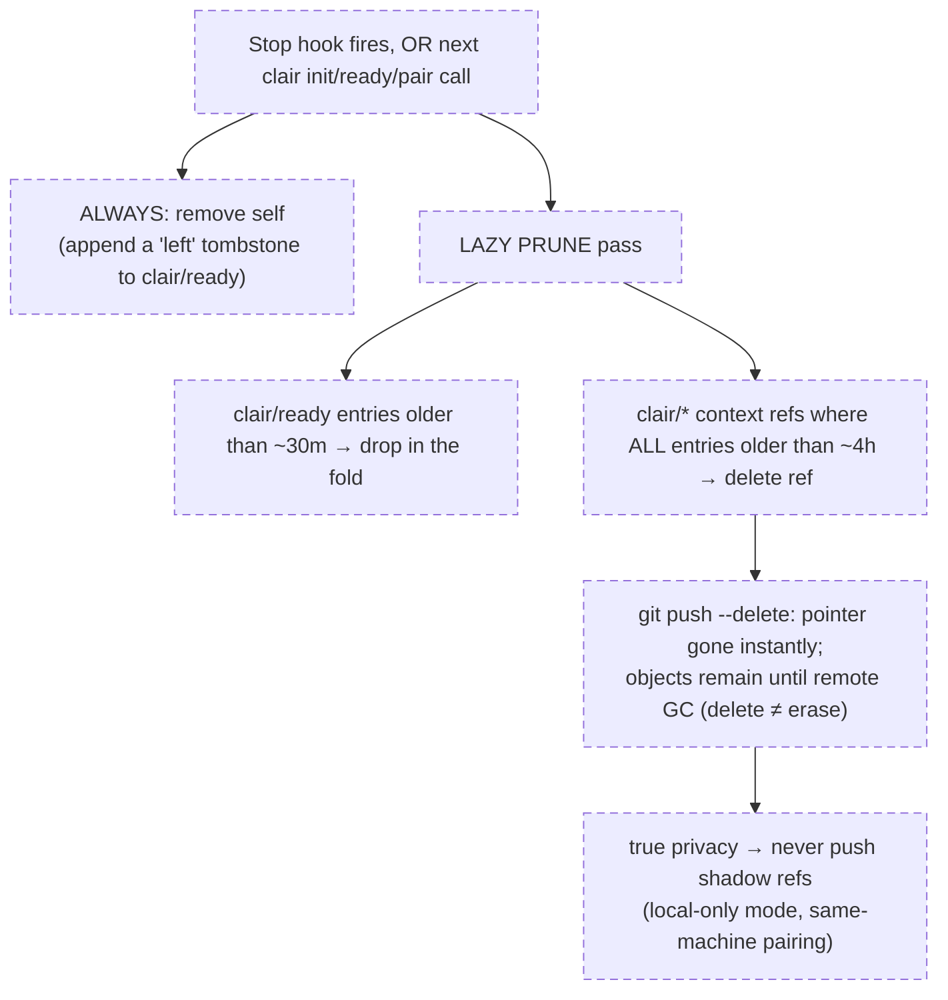

# clair — Target Architecture

> A visual synthesis of where clair is heading. Diagrams are labelled **SHIPPED**
> (built + tested), **TARGET** (agreed, not yet built), or **SPECULATIVE** (an idea
> doc, design still open). Deep mechanics live in the linked ADRs and `features/`
> docs; this page is the map that ties them together.

## Thesis
clair lets developers pair through their AI harness. The **smarts live in one local
binary**; **Git is the only backend**; harnesses plug in through **portable, standard
surfaces** (MCP tools + an Agent Skill). No central server.

## Locked principles (see [vision](../seed-ideas.md))
Fat client / dumb pipe · **Git is the pipe** · branch-scoped · **ephemeral, not an
audit log** · two-pipe loop-safety · instant-wow.

---

## 1. System overview — SHIPPED
Each developer runs their own Claude Code with the clair plugin. The plugin carries
two background hooks, an MCP server (`clair serve`), and the CLI — all faces of one
Rust binary. The only thing crossing machines is **git**.

The **smarts** are entirely in `clair-core` (git shell-out + local logic); the hooks,
MCP server, and CLI are thin adapters over it.

---

## 2. Git as the only backend — branches & refs — SHIPPED (+ pair-branch idea)
clair **never writes to your working history**. It keeps its state on **orphan shadow
refs** that are never merged and are meant to be thrown away:

- **`clair/ready`** — the registry: who is available to pair, and on which branch.
- **`clair/<branch>`** (e.g. `clair/main`) — an append-only context log for that
  branch: `prompt`, `summary`, and `signal` (join) entries.

- **Identity / cursor are local-only**, in `.git/clair/` — `alias` and
  `cursor-<branch>` — never pushed (see [ADR 0005](../decisions/0005-identity-alias-with-teams-deferred.md)).
- **Live code sync** via a pair branch was considered and **ruled out**
  ([why](../features/ideas/pair-branch.md)): git is a poor live-co-edit medium, it is
  not clair's differentiator (Live Share et al. own that space), and it fights the
  never-touch-uncommitted-work rule. clair shares *AI context*, not bytes.

---

## 3. Pairing flow & the two-pipe loop-guard — SHIPPED
A handshake (`ready` → `pair` → `with`) puts both devs on one branch; then context
flows over `clair/<branch>`. Today delivery is **prompt-gated**: a peer's activity
surfaces when *you* next submit a prompt.

**The two-pipe loop-guard** is what stops two AIs ping-ponging forever:

Inbound is read-only (cursor is local), and outbound only fires on the user's own
prompt/stop — so receiving a peer entry produces zero new entries.

---

## 4. Delivery: prompt-gated today → ambient via Channels — SHIPPED + TARGET
The render already produces both an AI view and a human banner. Only the **trigger**
changes: from "on your next prompt" to "live, while you're idle," using Claude Code
**Channels** ([design](../features/ideas/push-updates.md)).

**Status of the target:** Channels is live as a *research preview* (Claude Code ≥
v2.1.80) but idle-delivery has open bugs; gated build — see
[push-updates.md](../features/ideas/push-updates.md) for the full how-to, the
`rmcp`-can-emit-a-notification spike, and the launch-flag caveat.

---

## 5. Identity — SHIPPED
Identity is a chosen **alias**, stored per-clone in `.git/clair/alias` (never your git
config). Resolution: `--as` → alias file → legacy `clair.user` → `user.name` → OS.
The same git account under two aliases = two distinct identities that see each other
(solo review). See [ADR 0005](../decisions/0005-identity-alias-with-teams-deferred.md);
[teams](../features/ideas/teams.md) generalises an alias to span many accounts
(deferred).

Framing of shared entries is **intent-classified by the sender's AI**, not a fixed
verb — [ADR 0006](../decisions/0006-intent-classified-actor-framing.md).

---

## 6. Lifecycle & cleanup — SPECULATIVE
The **ephemeral** principle needs teeth: shadow refs must not accumulate forever.
Design in [lifecycle.md](../features/ideas/lifecycle.md) — split between a clean exit
and a lazy prune that the *next* person to touch clair inherits.

Open mechanics still to settle: "remove self" from an append-only registry means a
**tombstone**, not a delete; a pruned-then-recreated ref should also drop its stale
local cursor; TTLs are guesses.

---

## Components
- **`clair-core`** (Rust lib) — all git + local logic. The only place with brains.
  Unit + BDD tested with no harness involved.
- **`clair` binary** — the CLI; `clair serve` additionally runs an MCP server (`rmcp`).
  One artifact, several faces.
- **Agent Skill + slash commands** — portable `SKILL.md` driving the binary; the
  human UX (`/clair`, `/clair:with @rajiv`). A standard, not Claude-specific.
- **Two background hooks** — `UserPromptSubmit` (inbound + share-prompt) and `Stop`
  (share-summary), bundled in the plugin, auto-firing.

## Decisions
| # | Decision |
|---|----------|
| [0001](../decisions/0001-language-rust.md) | Build clair in Rust |
| [0002](../decisions/0002-git-via-shell-out.md) | Talk to Git by shelling out |
| [0003](../decisions/0003-dual-integration-mcp-and-skill.md) | Integrate via both MCP and Agent Skill |
| [0004](../decisions/0004-delivery-pluggable-live-via-watcher.md) | Pluggable delivery; live via watcher + Channels (proposed) |
| [0005](../decisions/0005-identity-alias-with-teams-deferred.md) | Identity is a chosen alias (teams deferred) |
| [0006](../decisions/0006-intent-classified-actor-framing.md) | Shared-entry framing is intent-classified |

## Idea backlog (`features/ideas/`)
[push-updates](../features/ideas/push-updates.md) (ambient delivery via Channels) ·
[lifecycle](../features/ideas/lifecycle.md) (cleanup) ·
[pair-branch](../features/ideas/pair-branch.md) (live code sync — RULED OUT) ·
[teams](../features/ideas/teams.md) · [chat](../features/ideas/chat.md) ·
[context-sync](../features/ideas/context-sync.md)
