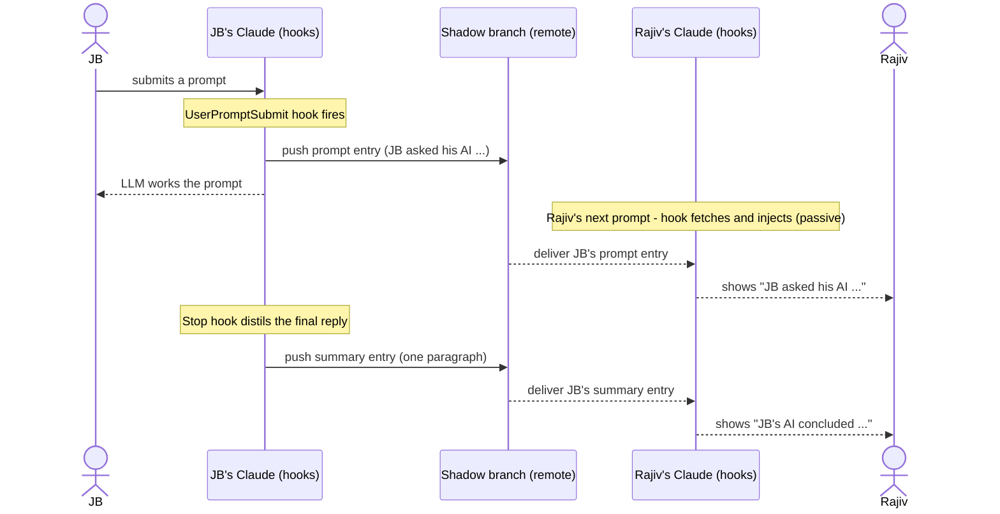
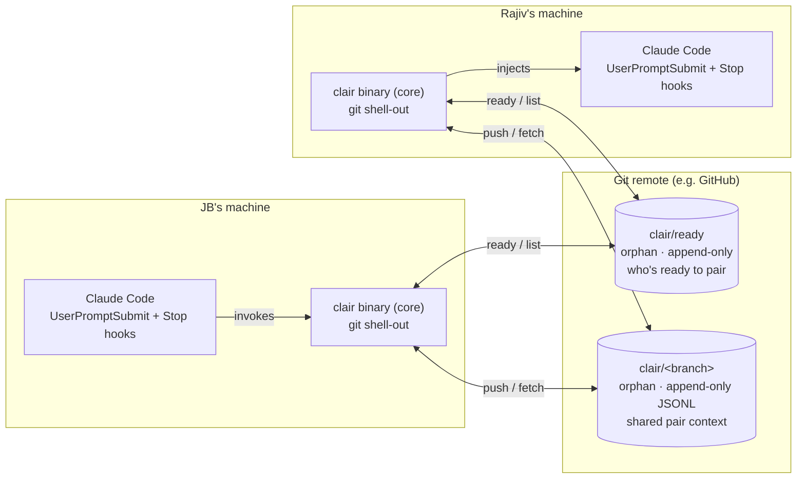
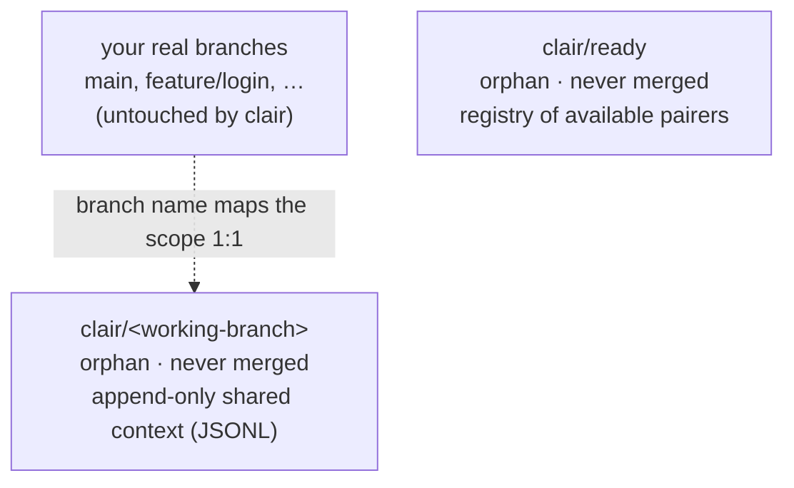

# Slice 1 — The Shared Pair Brain (v0)

**Status:** doing · 2026-06-25
**Destination it serves:** *shared memory / two brains, one context* — your Claude stays
aware of what your pair's Claude just did, through git, ephemeral, no server.

> This is the first **lean vertical slice**: it stands up the whole foundation (Rust
> workspace, `clair-core`, git shell-out, cucumber-rs harness, the Claude hooks/skill) and
> delivers a real, felt moment — *"whoa, my Claude already knew what Rajiv did."*

---

## 1. The felt experience

JB and Rajiv each work in their **own** Claude, both on branch `feature/login`.

1. JB types a prompt. Rajiv sees, in **his** Claude session: `↪ JB asked his AI: "refactor the auth guard…"` — and it does **not** make Rajiv's AI do anything.
2. JB's Claude finishes its work. Its final reply is distilled to one paragraph and surfaces in Rajiv's session: `✓ JB's AI concluded: "Moved the guard to middleware; tests still red on the token case."`
3. Symmetric the other way. Each person's Claude is quietly **aware** of the pair's latest context on their next turn.

No new ritual: you just use Claude. clair shares your deltas and shows you theirs.

## 1a. What the users see (v0 walkthrough)

The agreed user experience for slice 1. *Delivery note:* incoming items surface the moment
the recipient **next interacts** (slice-1 mechanism); true idle/live push is slice 2 (§6a, §8).

**① Discovery is repo-wide and branch-aware**

JB (on `feature/login`):
```
> /clair ready
✓ You're available to pair  ·  repo: clair  ·  branch: feature/login
```
Rajiv (on a *different* branch, e.g. `main`):
```
> /clair pair
People ready to pair on  clair:
  • JB    →  feature/login     (ready 30s ago)
  • Sam   →  fix/cache-bug     (ready 2m ago)
Join with:  /clair with jb

> /clair with jb
↪ Switching you to feature/login (git fetch + checkout)…
🤝 Pairing with JB on feature/login. Ephemeral — nothing is logged permanently.
```
JB (on his next interaction):
```
── clair ──────────────────────────────────
🤝 Rajiv joined the pair session on feature/login.
───────────────────────────────────────────
```

**② JB works — prompt shared on ask, conclusion shared on finish (two separate events)**

JB (normal Claude use):
```
> refactor the auth guard to use the new middleware
● I'll move the guard into AuthMiddleware…
  [edits auth.rs, runs tests]
● Done. Guard now in AuthMiddleware; 1 test still failing on the expired-token case.
```
Rajiv sees JB's **question as soon as he asks it** (not waiting for JB's AI), and the
**conclusion when it finishes** — each injected as background, his AI does not act on it:
```
── shared pair context (background — your AI won't act on this) ──
↪ JB asked his AI:  "refactor the auth guard to use the new middleware"
─────────────────────────────────────────────────────────────────
   …(later, when JB's reply completes)…
── shared pair context (background — your AI won't act on this) ──
✓ JB's AI concluded: "Moved the guard into AuthMiddleware; 1 test still failing
   on the expired-token case."
─────────────────────────────────────────────────────────────────
```

**③ Reciprocal** — JB sees Rajiv's prompts + conclusions the same way, on his next interaction.

**Felt result:** two people, two Claudes, each silently kept aware of the other's work
through git — no server, scoped to the branch, nothing permanent. *"My Claude already knew."*

## 2. Commands (the Agent Skill surface)

| Command | Effect |
|---------|--------|
| `/clair ready` | Register me as **available to pair** in this repo (writes my entry, **including my current branch**, to the `clair/ready` registry, pushes). |
| `/clair pair` | Fetch the registry and **list everyone ready** to pair in this repo, **with their branch** — regardless of which branch I'm currently on. |
| `/clair with rajiv` | Resolve `rajiv` to a registered user, **`git fetch` + check out their branch** (creating a tracking branch if needed; **stops with a clear message if my working tree is dirty** — never moves my work silently), then **start the pairing session** on that branch and activate the capture+inject hooks. |

## 3. How content actually reaches the session (confirmed mechanism)

Built on Claude Code hooks (verified capabilities):

- **Outbound — capture:**
  - `UserPromptSubmit` hook → captures my prompt → `clair` pushes a `prompt` entry.
  - `Stop` hook (fires when Claude finishes) → reads the final reply from the transcript, distils a one-paragraph summary → `clair` pushes a `summary` entry.
- **Inbound — deliver:**
  - `UserPromptSubmit` hook → `clair` fetches the shared branch and returns my pair's **new** entries as `additionalContext` (≤10k chars), so they're visible and my Claude is aware — passively, riding my own next prompt. **No autonomous LLM turn.**

**Ambient idle-push (while you touch nothing) is OUT of slice 1.** The candidate is
**Channels** (MCP `claude/channel` + `--channels`, Claude Code ≥ 2.1.80), but it needs
Anthropic auth + an opt-in flag, and channel messages are *reacted to* by Claude — which
risks the echo loop. → tracked as a spike (§8), not built here.

## 4. Data flow



## 5. Components



## 6. Git branching (the backend)

All clair state lives on **orphan branches** prefixed `clair/` — never merged into code,
zero impact on history.



- **`clair/ready`** — one registry for the repo. Append-only entries; latest-per-user wins.
- **`clair/<working-branch>`** — the shared context for that branch's pairing session.
  Append-only JSONL ⇒ concurrent writes never text-conflict (sidesteps the merge-driver
  question entirely, and fits *ephemeral, not an audit log*).

### Data model

```jsonc
// clair/<branch>  — one JSON object per line
{ "id":"uuid", "author":"JB", "kind":"prompt|summary|signal",
  "text":"…", "ts":"2026-06-25T10:00:00Z", "turn":"uuid" }

// clair/ready — one object per line, latest-per-user wins
{ "user":"JB", "repo":"clair", "branch":"feature/login", "ts":"…" }
```

## 6a. Keeping live delivery open (the seam that must not close)

Slice 1 delivers updates by **pull at next interaction**. Slice 2 wants **push, ambient**.
We must not build slice 1 in a way that blocks slice 2. The protection: three decoupled
concerns, with delivery swappable.

```
Capture (hooks)  →  Store (git: append-only, addressable entries + local last-seen cursor)  →  Delivery
                                                                                               ├ slice 1: PULL at next interaction (UserPromptSubmit hook)
                                                                                               └ slice 2: PUSH, ambient (background watcher + Channels)
```

**Both delivery modes read the same store through one function: `entries_since(cursor)`.**
Swapping pull → push is therefore additive, not a rewrite.

Constraints slice 1 **must** honour so live stays reachable:
- every entry carries a **monotonic id + timestamp + author** (already in the data model);
- each consumer tracks a **local last-seen cursor**;
- inbound delivery goes through a single `entries_since(cursor)` read, reused later by the watcher.

**The watcher is a plain process, never an LLM agent.** Live delivery (slice 2) is a
long-running `clair` process (`clair watch`/`serve`) that fetches and, on new entries,
surfaces them via Channels. It only **detects + delivers** — it never **generates**. A
parallel *LLM* agent "watching" is explicitly rejected: it would burn tokens, can't render
into the main session independently, and an LLM reacting to entries re-opens the echo loop.
See [ADR 0004](../../decisions/0004-delivery-pluggable-live-via-watcher.md).

## 7. Loop prevention (the guard, made concrete)

- **Two pipes never cross:** *inbound* (fetch → display/inject) never writes; *outbound*
  (push) only fires from **my own** `UserPromptSubmit`/`Stop` turns.
- **Deltas only:** the summary describes *my* turn, never recaps the pair's state.
- **Provenance + last-seen id:** inject only the pair's entries I haven't seen; never my own.
- **Regression test:** *receiving/injecting a peer entry produces zero new entries.*

## 8. Open questions / spikes

1. **Ambient idle-push (slice 2)** — can a **Channel** message be made display-only (passive)
   so it doesn't trigger the recipient's LLM? If yes, that's the path to true live updates via
   the watcher. (→ [ADR 0004](../../decisions/0004-delivery-pluggable-live-via-watcher.md); spike before slice 2.)
2. **Summarisation source** — slice 1: the skill asks Claude to emit a one-paragraph shared
   summary as the last step of each turn; the `Stop` hook captures it. (Alt: `clair` calls a
   local model.)
3. **Prompt privacy** — slice 1 shares the prompt text verbatim, framed "JB asked his AI: …".
   A redaction/opt-out toggle is future work.
4. **Identity resolution** — `with rajiv` fuzzy-matching a registry handle; slice 1 may
   require a near-exact handle.

## 9. Test approach (BDD-first)

cucumber-rs `.feature` files run against a **local bare repo as the remote** + two working
copies (JB, Rajiv) — also the local dev setup a user can poke. Scenarios:

- `ready` → my entry appears in the registry; `pair` lists it.
- `with rajiv` → a session signal is visible to the other side.
- A `prompt` entry propagates and renders framed in the pair's context.
- A `summary` entry propagates and renders.
- **Loop guard:** receiving an entry writes nothing back.
- **Scope:** entries on branch A are invisible on branch B.

## 10. Scope

**In:** the three commands, prompt+summary capture/share, passive inbound injection, orphan
shadow branches, append-only model, loop guards, cucumber harness, the thin Claude skill+hooks.

**Out (later slices):** ambient idle-push (Channels), true single shared conversation,
compaction, rich/structured memory, non-Claude harness adapters (isolate behind a capture
trait, don't build), identity fuzzy-matching polish.
